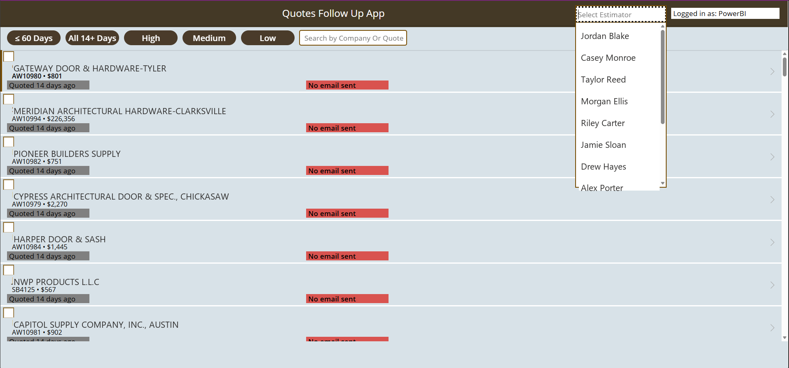
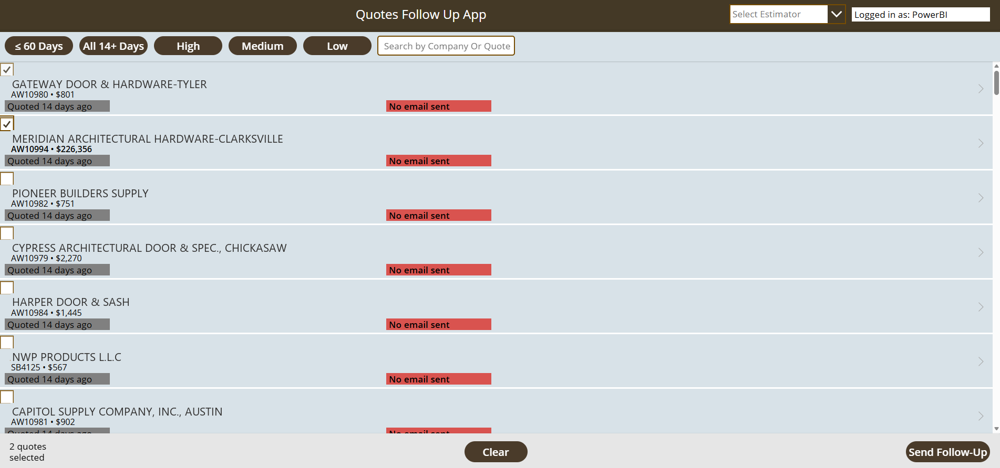
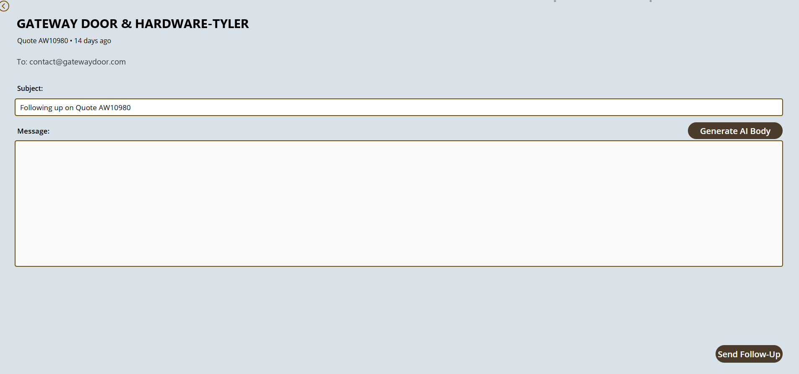

# Quote Follow-Up App

A Power Apps Canvas app that surfaces aging, un-converted quotes and lets estimators send targeted follow-up emails in a couple of taps — with an AI-drafted message body and a full send-history audit trail.

> **Client engagement.** Built as a production solution for a client in the commercial door & hardware manufacturing industry. Customer names, estimator names, and email addresses shown in the screenshots have been replaced with fictional equivalents to protect client confidentiality.

## Overview

Quotes that sit for two weeks without converting are where revenue quietly leaks. This app gives each estimator a live worklist of their own quotes that are 14+ days old and still open, ranked by value, so nothing slips — and makes the follow-up itself a one-screen action.

## Key Features

- **Aging-quote worklist** — only quotes that are 14+ days old and not yet converted to an order.
- **Estimator + priority filters** — filter by estimator, by age (≤ 60 days / all 14+ days), and by value tier (High / Medium / Low).
- **Search** — find a quote by company or quote number.
- **Bulk select & send** — tick multiple quotes and send follow-ups in one action.
- **AI-drafted email body** — generate a follow-up message, then edit before sending.
- **Send-history audit** — every send (including test sends) is logged: recipient, subject, body, sender, and timestamp.

## Tech Stack

- **Power Apps** (Canvas app)
- **SQL Server** (aging-quote view + send-history table)
- **Power Automate** (sends the follow-up emails)
- **AI text generation** for the email body

## Screenshots

| Quote worklist + estimator filter | Bulk selection | Compose & send |
|---|---|---|
|  |  |  |

## Data Model

See [`sql/`](sql/):

- `01-quote-followup-view.sql` — `vw_quote_followup_14days`: joins order, customer, sales rep, and estimator data and flags quotes 14+ days old that haven't converted (the updated version also restricts to live/open order states).
- `02-send-history-table.sql` — `quote_followup_send_history`: append-only log of every follow-up email sent.

---

*Screenshots use anonymized sample data. The database name (`ClientDW`) is a placeholder.*
